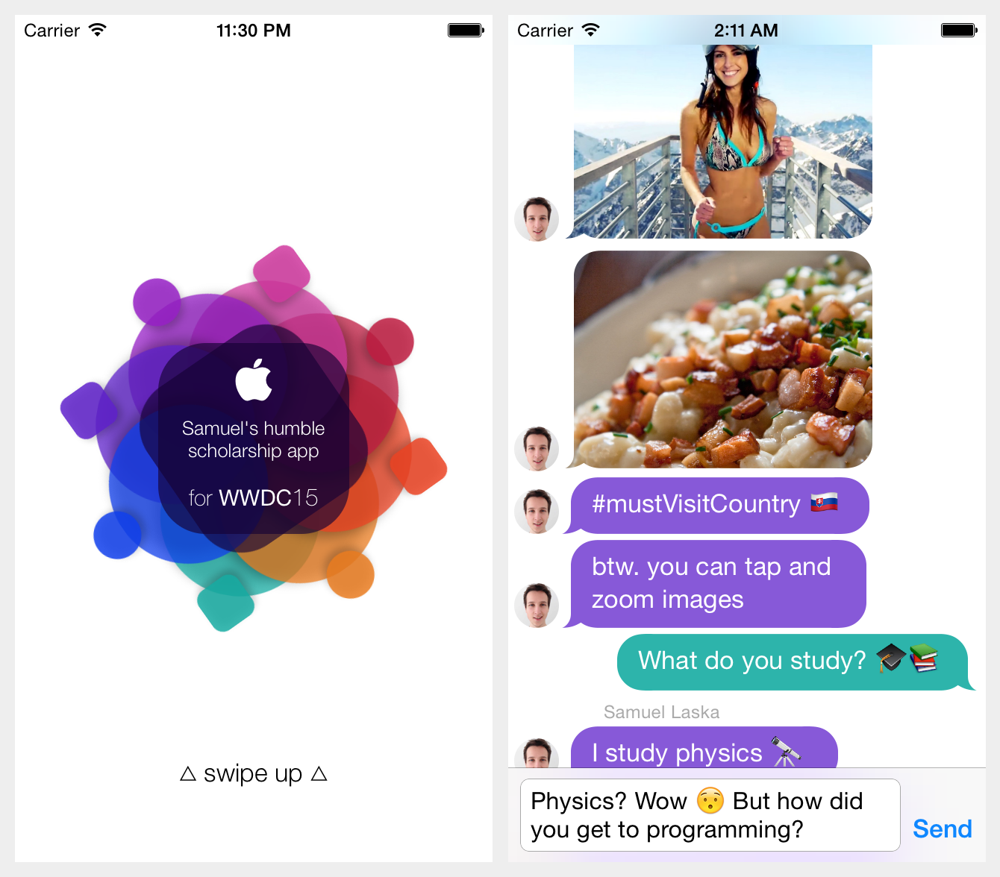

Apple WWDC 2015 Scholarship Submission
======================================

Finished in 3 days, the app should have been a showcase of technical skill, experience and creativity. 

The initial wow factor was delivered with intro animation powered by CoreGraphics beautifuly
revealing the new WWDC logo. 
I wanted to keep "resume" part simple and engaging so I choose
to deliver it via automated dialog inside custom messages interface. This way, everything
is presented as a story and nothing important will be skipped through. I used emoticons and images
frequently to make conversation more personal and colorful. I may have left some Tim Cook joke inside..

To the end I added option to actually type in an response that would be delivered to my email. After typing 
in goodbye you would be brought back to home screen.

